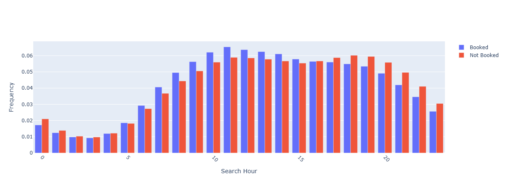
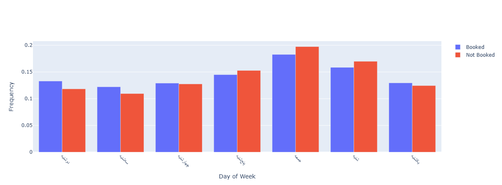
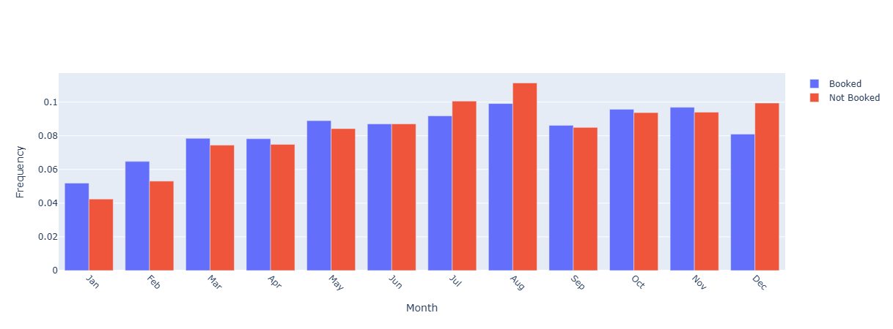
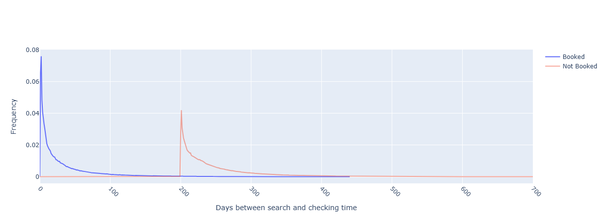
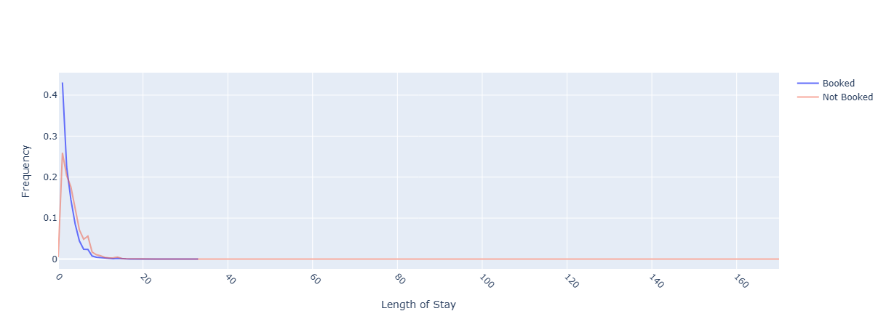

# 🏨 Hotel Booking Prediction using Deep Neural Networks


---

## 📌 Overview

Online travel platforms receive millions of hotel searches every day. Understanding whether a user is likely to book a viewed hotel can significantly improve recommendation systems, personalized marketing campaigns, and conversion rates.

This project develops a **Deep Neural Network (DNN)** model that predicts whether a user will book a hotel based on search behavior, hotel attributes, temporal information, and location-related features.

### Real-World Applications

* Personalized hotel recommendations
* Dynamic discount generation
* User conversion optimization
* Marketing campaign targeting
* Revenue management systems

---

## 🎯 Problem Statement

Given user search information and hotel-related features, predict:

```text
is_booking
```

Where:

* **1** → User booked the hotel
* **0** → User did not book the hotel

This is a **binary classification** problem.

---

## 🏆 Results Summary

| Model               | Validation ROC-AUC |
| ------------------- | ------------------ |
| Deep Neural Network | **0.7417**         |

✅ The model successfully learns meaningful booking patterns from user search behavior and hotel-related information.

---

## 📊 Dataset

The dataset contains information related to:

* User search behavior
* Hotel characteristics
* Search timestamps
* Check-in and check-out dates
* User location
* Hotel location
* Historical booking information

**Target Variable**

```text
is_booking
```

---

## 🔧 Data Preprocessing

The following preprocessing techniques were applied before training:

### Data Cleaning

* Missing value handling
* Data type correction
* Removal of irrelevant features
* Datetime conversion and parsing

### Feature Engineering

Several new features were created to improve predictive performance:

* Length of Stay (LOS)
* Days Between Search and Check-in
* Search Hour
* Search Month
* Check-in Month
* Check-in Weekday
* Booking Lead Time Features

---

## 📈 Exploratory Data Analysis (EDA)

Several visual analyses were performed to better understand user behavior and booking patterns.

### Search Hour Distribution



---

### Check-in Day Distribution



---

### Check-in Month Distribution



---

### Booking Lead Time Analysis



---

### Length of Stay Analysis



---

## 🧠 Deep Learning Model

A fully connected Deep Neural Network was developed using TensorFlow/Keras.

### Architecture

```text
Input Layer
      ↓
Dense(128)
      ↓
BatchNormalization
      ↓
ReLU
      ↓
Dropout(0.30)

Dense(64)
      ↓
BatchNormalization
      ↓
ReLU
      ↓
Dropout(0.25)

Dense(32)
      ↓
BatchNormalization
      ↓
ReLU
      ↓
Dropout(0.25)

Output Layer (Sigmoid)
```

---

## ⚖️ Class Imbalance Handling

Booking events occur much less frequently than non-booking events.

To address this issue:

* Class weights were calculated
* Weighted training was applied during model fitting

This improved the model's ability to detect booking events.

---

## 📊 Model Evaluation

The model was evaluated using the **ROC-AUC** metric on the validation dataset.

| Metric             | Score      |
| ------------------ | ---------- |
| Validation ROC-AUC | **0.7417** |

### Interpretation

A ROC-AUC score of **0.7417** indicates that the model can distinguish between booking and non-booking users with good predictive performance.

The result demonstrates that the engineered features and neural network architecture successfully capture meaningful patterns in user behavior.

---

## 🛠 Technologies Used

* Python
* Pandas
* NumPy
* Scikit-Learn
* TensorFlow
* Keras
* Plotly
* Jupyter Notebook

---

## 📂 Project Structure

```text
hotel-booking-prediction-dnn/
│
├── data/
│   └── README.md
│
├── images/
│   ├── search_hour.png
│   ├── checkin_day.png
│   ├── checkin_date_month.png
│   ├── days_between.png
│   └── los.png
│
├── notebooks/
│   └── hotel_booking_prediction.ipynb
│
├── README.md
├── LICENSE
├── requirements.txt
└── .gitignore
```

---

## 🚀 Installation

Clone the repository:

```bash
git clone https://github.com/moeinalva/hotel-booking-prediction-dnn.git
```

Install dependencies:

```bash
pip install -r requirements.txt
```

Launch Jupyter Notebook:

```bash
jupyter notebook
```

---

## 🔮 Future Improvements

* Hyperparameter Optimization
* Cross Validation
* XGBoost Comparison
* Ensemble Learning
* Feature Selection
* Embedding Layers for Categorical Features
* Automated Feature Engineering

---

## 👨‍💻 Author

**Moein Alva**

M.Sc. Student | Machine Learning & Deep Learning Enthusiast

GitHub: https://github.com/moeinalva

---

## 📄 License

This project is licensed under the MIT License.
